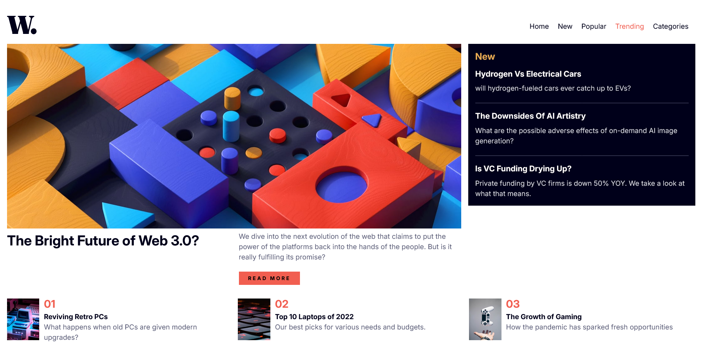

# Frontend Mentor - News homepage solution

This is a solution to the [News homepage challenge on Frontend Mentor](https://www.frontendmentor.io/challenges/news-homepage-H6SWTa1MFl). Frontend Mentor challenges help you improve your coding skills by building realistic projects.

## Table of contents

- [Overview](#overview)
  - [The challenge](#the-challenge)
  - [Screenshot](#screenshot)
  - [Links](#links)
- [My process](#my-process)
  - [Built with](#built-with)
  - [Continued development](#continued-development)
- [Author](#author)

## Overview

This is my solution for the News homepage challenge.

### The challenge

Users should be able to:

- View the optimal layout for the interface depending on their device's screen size
- See hover and focus states for all interactive elements on the page

### Screenshot

### Links

- Solution URL: 
- Live Site URL: 

## My process

I built this website using the mobile first approach. And I also built it using the component based approach.

### Built with

- Semantic HTML5 markup
- CSS custom properties
- Flexbox
- CSS Grid
- Mobile-first workflow

### Continued development

I will continue refining my layout skills as i am not still perfect in laying elements out using the
grid layout. Also I will continue learning JavaScript because my foundation in it isn't set quite yet.
I'm a beginner afterall.

## Author

- Frontend Mentor - [@samimkabiru](https://www.frontendmentor.io/profile/samimkabiru)
- Twitter - [@ninja_coder_01](https://www.twitter.com/ninja_coder_01)
